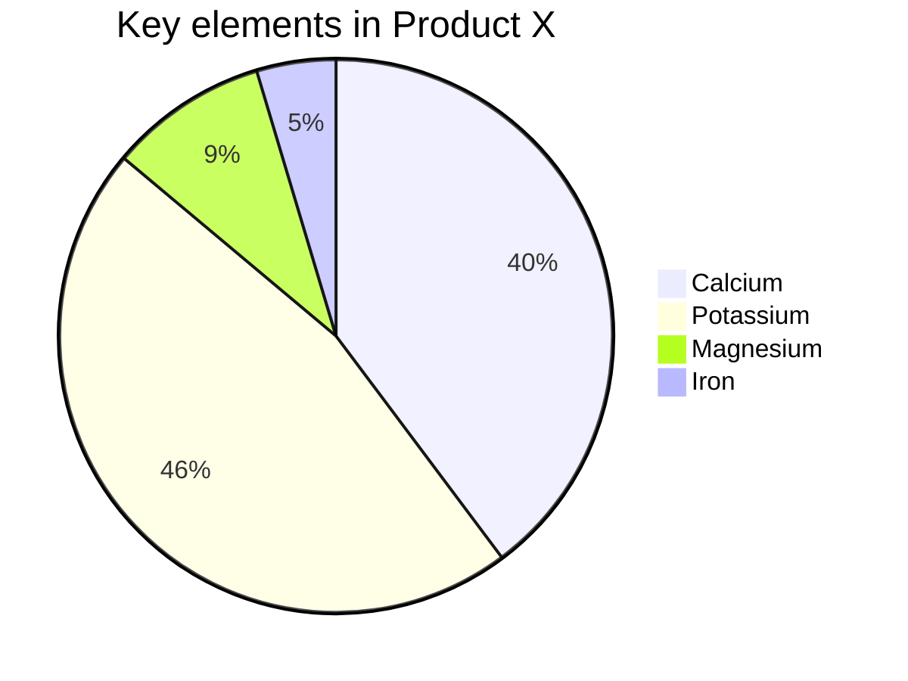
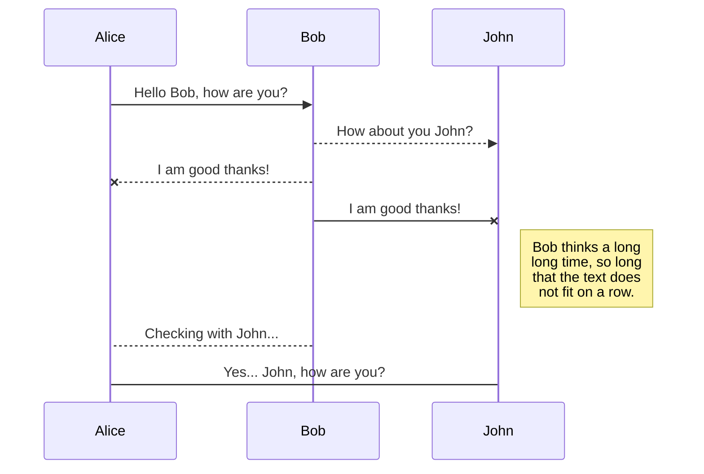

# NetCoreUtils

%%{init: {'theme': 'base', 'themeVariables': { 'textColor': 'white'}}}%%

%%{init: {'theme': 'base', 'themeVariables': { 'textColor': 'white'}}}%%

## NuGet

https://www.nuget.org/packages/NetCoreUtils/

## Release Notes

### v1.3.0 (working)

**Enhancement**:

- Add JsonConfigOperator
- Add ProcUtil
- Add SystemUtil
- Update SafeCall.Execute() to use Console.Error.WriteLine()

**Breaking Change**:

- Rename ShellExecutor to TerminalUtil
- Move namespaces Expression and Reflection to Lang

### v1.2.0

**Enhancement**:

- Add ExpressionUtil
- Add NetCoreUtils.Text.Table
- Add NetCoreUtils.Text.Indent

**Breaking Change**:

- Move String, Xml to Text namespace

### v1.1.0.6

- Add MethodCall.Pipeline

### v1.0.0.5

*Breaking Change*:

- Upgrade to .net core 3.1
- Add ReflectUtil

### v0.3.0.4

*Enhancement*:

- Add PipeForwardExt

*Breaking Change*:

- Upgrade to .net core 2.2
- Rename namespace "Misc" to "MethodCall"

### v0.2.0.3

*Enhancement*:

- Add Logger
- Add SafeCaller

*Breaking Change*:

- Rename namespace "Diagnose" to "Diagnosis"
